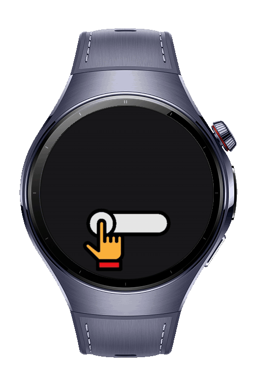

> **Note:** To access all shared projects, get information about environment setup, and view other guides, please visit [Explore-In-HMOS-Wearable Index](https://github.com/Explore-In-HMOS-Wearable/hmos-index).

# How to monitor Bluetooth Connectivity

A HarmonyOS ArkTS application that monitors Bluetooth connectivity state, notifies the user, and runs in the background for continuous service availability. Includes a splash screen with Lottie animation.

# Preview

# Use Cases

-   Display splash animation before entering the app
-   Monitor Bluetooth state (ON/OFF) in real-time
-   Notify user when Bluetooth is required but turned off
-   Start/stop service with background running support
-   Clean UI optimized for wearables

# Technology

## Stack

-   **Languages:** ArkTS (TypeScript)
-   **UI:** ArkUI (`@kit.ArkUI`)
-   **Tools/IDE:** DevEco Studio **5.1.0.260**
-   **SDK:** HarmonyOS SDK **5.1.0.54**
-   **Libraries:** ConnectivityKit, AbilityKit, BackgroundTasksKit,
    NotificationKit, BasicServicesKit
-   **Animation:** Lottie

## Required Permissions

-   `ohos.permission.DISTRIBUTED_DATASYNC`
-   `ohos.permission.NOTIFICATION_CONTROLLER`

# Directory Structure

    entry/
    └── ets/
        ├── animation/
        │   └── LottieAnimation.ets
        ├── entryability/
        │   └── EntryAbility.ets
        ├── entrybackupability/
        │   └── EntryBackupAbility.ets
        ├── pages/
        │   ├── Index.ets
        │   └── SplashPage.ets
        ├── util/
        │   └── ConstantUI.ets
        └── AdapterManager.ets

# Constraints and Restrictions

## Supported Device

-   Huawei Watch 5

## App Limits

-   Runs continuously with background service
-   Optimized for Bluetooth connectivity monitoring
-   ArkUI navigation with transitions

# LICENSE 

**Bluetooth Connectivity Monitor** is distributed under the terms of the
MIT License. See the [LICENSE](./LICENSE) for more information.
